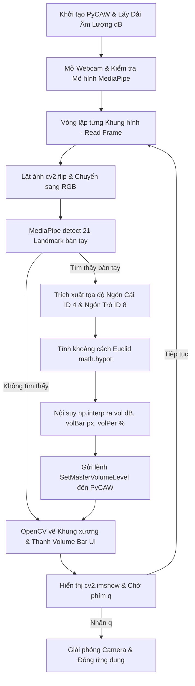

# TÀI LIỆU CHI TIẾT: VAI TRÒ VÀ NGUYÊN LÝ HOẠT ĐỘNG CÁC THƯ VIỆN TRONG DỰ ÁN

## 1. Tổng Quan Dự Án

Dự án **Hand Tracking Volume Control** là một ứng dụng Python thời gian thực (real-time) cho phép người dùng điều khiển âm lượng hệ thống (Master Volume) của máy tính Windows thông qua cử chỉ ngón tay (khoảng cách giữa ngón tay cái và ngón tay trỏ) trước Webcam.

Mã nguồn chính của dự án nằm trong tệp [main.py](file:///c:/Users/DELL/Downloads/UDVolume/main.py) và các thư viện phụ thuộc được khai báo tại [requirements.txt](file:///c:/Users/DELL/Downloads/UDVolume/requirements.txt).

---

## 2. Bảng Tóm Tắt Vai Trò Các Thư Viện

| Thư viện | Tên Import | Vai trò chính trong dự án |
| :--- | :--- | :--- |
| **`opencv-python`** | `cv2` | Đọc luồng video webcam, xử lý hình ảnh (lật ảnh, chuyển đổi hệ màu), vẽ giao diện người dùng (UI) và hiển thị cửa sổ ứng dụng. |
| **`mediapipe`** | `mp` | Mô hình Trí tuệ Nhân tạo / Thị giác máy tính nhận diện bàn tay và trích xuất tọa độ 21 điểm mốc (Hand Landmarks) theo thời gian thực. |
| **`pycaw`** | `pycaw.pycaw` | Giao tiếp với Windows Core Audio APIs (WASAPI) để đọc dải âm lượng phần cứng và thay đổi âm lượng Master của hệ điều hành. |
| **`comtypes`** | `comtypes` | Cung cấp giao tiếp FFI/COM (Component Object Model) giúp Python gọi trực tiếp các API hệ thống C++ trên Windows. |
| **`numpy`** | `numpy` / `np` | Xử lý ma trận điểm ảnh và ánh xạ tuyến tính (interpolation) khoảng cách ngón tay sang giá trị dB âm lượng và đồ họa UI. |
| **`math`** | `math` | Thư viện chuẩn dùng để tính khoảng cách Euclid (độ dài) giữa hai điểm tọa độ ngón tay. |
| **`os` & `urllib`** | `os`, `urllib.request` | Thư viện chuẩn quản lý tệp tin và tự động tải xuống tệp mô hình AI (`hand_landmarker.task`) từ Google Cloud nếu chưa có. |

---

## 3. Vai Trò Chi Tiết Và Nguyên Lý Hoạt Động Trong Code

### 3.1 `opencv-python` (`cv2`)

#### Vai trò:
OpenCV (Open Source Computer Vision Library) đảm nhận toàn bộ quy trình nhận đầu vào từ phần cứng camera, xử lý các khung ảnh nguyên thủy, vẽ các thành phần tương tác trực quan và quản lý cửa sổ hiển thị.

#### Nguyên lý hoạt động chi tiết trong mã nguồn:
1. **Khởi tạo và kết nối Webcam**:
   - `cap = cv2.VideoCapture(0)` ([main.py:69](file:///c:/Users/DELL/Downloads/UDVolume/main.py#L69)): Mở luồng nhận dạng từ webcam mặc định của thiết bị (index `0`).
   - `success, img = cap.read()` ([main.py:78](file:///c:/Users/DELL/Downloads/UDVolume/main.py#L78)): Đọc từng khung hình (frame) từ camera. Khung hình được trả về dưới dạng mảng đa chiều `numpy.ndarray` với hệ màu mặc định là **BGR** (Blue - Green - Red).

2. **Tiền xử lý khung hình**:
   - `cv2.flip(img, 1)` ([main.py:83](file:///c:/Users/DELL/Downloads/UDVolume/main.py#L83)): Lật ảnh qua trục tung (trục dọc, mã lệnh `1`). Việc này tạo ra hiệu ứng "soi gương", giúp thao tác đưa tay sang trái/phải hiển thị tự nhiên trên màn hình.
   - `cv2.cvtColor(img, cv2.COLOR_BGR2RGB)` ([main.py:85](file:///c:/Users/DELL/Downloads/UDVolume/main.py#L85)): Chuyển đổi không gian màu từ BGR của OpenCV sang **RGB** tiêu chuẩn để đáp ứng định dạng đầu vào bắt buộc của MediaPipe.

3. **Vẽ các thành phần đồ họa (Graphic Overlay)**:
   - `cv2.line()`, `cv2.circle()` ([main.py:100-107](file:///c:/Users/DELL/Downloads/UDVolume/main.py#L100-L107), [main.py:125-128](file:///c:/Users/DELL/Downloads/UDVolume/main.py#L125-L128)): Vẽ khung xương kết nối các khớp bàn tay, vẽ điểm tròn tại đầu ngón cái (ID 4), đầu ngón trỏ (ID 8) và tâm giữa hai ngón tay.
   - `cv2.rectangle()` ([main.py:152-154](file:///c:/Users/DELL/Downloads/UDVolume/main.py#L152-L154)): Vẽ khung viền và phần màu lấp đầy của thanh âm lượng (Volume Bar).
   - `cv2.putText()` ([main.py:156-157](file:///c:/Users/DELL/Downloads/UDVolume/main.py#L156-L157)): Hiển thị chỉ số phần trăm âm lượng (ví dụ: `75 %`) lên màn hình với phông chữ `FONT_HERSHEY_COMPLEX`.

4. **Hiển thị và Điều khiển luồng**:
   - `cv2.imshow("Hand Tracking Volume Control", img)` ([main.py:159](file:///c:/Users/DELL/Downloads/UDVolume/main.py#L159)): Render khung hình đã vẽ overlay lên cửa sổ GUI.
   - `cv2.waitKey(1)` ([main.py:162](file:///c:/Users/DELL/Downloads/UDVolume/main.py#L162)): Chờ 1 mili-giây để bắt sự kiện phím ấn từ bàn phím. Nếu nhấn phím `'q'`, thoát khỏi vòng lặp `while`.
   - `cap.release()` & `cv2.destroyAllWindows()` ([main.py:165-166](file:///c:/Users/DELL/Downloads/UDVolume/main.py#L165-L166)): Giải phóng tài nguyên camera và đóng toàn bộ cửa sổ đồ họa khi kết thúc chương trình.

---

### 3.2 `mediapipe` (`mp`)

#### Vai trò:
MediaPipe là thư viện học máy (Machine Learning) mã nguồn mở của Google. Trong dự án, MediaPipe đóng vai trò cốt lõi là **định vị bàn tay** và **phân tích tọa độ 3D của 21 điểm mốc khớp bàn tay (Hand Landmarks)** trong không gian ảnh.

#### Nguyên lý hoạt động chi tiết trong mã nguồn:
1. **Kiểm tra và Tương thích phiên bản (Dual-API Handling)**:
   - `use_tasks_api = not hasattr(mp, 'solutions')` ([main.py:27](file:///c:/Users/DELL/Downloads/UDVolume/main.py#L27)): Code hỗ trợ linh hoạt cả phiên bản MediaPipe 1.0+ mới (sử dụng Tasks API) lẫn phiên bản cũ (Solutions API).

2. **Khởi tạo Detector & Tải mô hình AI**:
   - Nếu dùng Tasks API, dự án sử dụng mô hình Deep Learning nhẹ `hand_landmarker.task` ([main.py:42-58](file:///c:/Users/DELL/Downloads/UDVolume/main.py#L42-L58)).
   - Cấu hình các tham số ngưỡng tin cậy:
     - `min_hand_detection_confidence = 0.7`: Ngưỡng tin cậy tối thiểu (70%) để mô hình xác nhận có bàn tay xuất hiện.
     - `min_tracking_confidence = 0.7`: Ngưỡng tin cậy tối thiểu để tiếp tục theo vết bàn tay ở các frame tiếp theo mà không cần chạy lại bộ phát hiện toàn khung hình.

3. **Phân tích hình ảnh & Trích xuất tọa độ**:
   - Chuyển mảng RGB thành đối tượng `mp.Image` và gọi `detector.detect(mp_image)` ([main.py:90-91](file:///c:/Users/DELL/Downloads/UDVolume/main.py#L90-L91)).
   - Tọa độ các điểm mốc do MediaPipe trả về là các số thực chuẩn hóa trong dải `[0.0, 1.0]` tương ứng với tỉ lệ chiều rộng ($x$) và chiều cao ($y$).
   - **Quy đổi tọa độ chuẩn hóa về tọa độ Pixel màn hình**:
     ```python
     cx, cy = int(lm.x * w), int(lm.y * h)
     ```
     ([main.py:96](file:///c:/Users/DELL/Downloads/UDVolume/main.py#L96)) trong đó `w` và `h` là chiều rộng và chiều cao ảnh từ OpenCV.

4. **Trích xuất 2 điểm mốc quyết định**:
   - Điểm mốc **ID 4**: Đầu ngón tay cái (`lmList[4]`).
   - Điểm mốc **ID 8**: Đầu ngón tay trỏ (`lmList[8]`).
   - Khoảng cách giữa điểm ID 4 và ID 8 sẽ quyết định mức âm lượng của hệ thống.

---

### 3.3 `pycaw` (Python Audio Control Library)

#### Vai trò:
`pycaw` là thư viện chuyên biệt dành cho Windows, cung cấp các binding Python để giao tiếp trực tiếp với **WASAPI (Windows Audio Session API)**. Nó cho phép ứng dụng can thiệp vào bộ điều khiển âm lượng hệ thống phần cứng mà không cần viết mã C/C++ phức tạp.

#### Nguyên lý hoạt động chi tiết trong mã nguồn:
1. **Khởi tạo kết nối thiết bị âm thanh**:
   - `device = AudioUtilities.GetSpeakers()` ([main.py:14](file:///c:/Users/DELL/Downloads/UDVolume/main.py#L14)): Lấy đối tượng đại diện cho thiết bị phát âm thanh mặc định (Loa/Tai nghe).
   - `volume = device.EndpointVolume` ([main.py:15](file:///c:/Users/DELL/Downloads/UDVolume/main.py#L15)): Truy vấn giao diện điều khiển `IAudioEndpointVolume`.

2. **Xác định dải âm lượng (Volume Range)**:
   - `volRange = volume.GetVolumeRange()` ([main.py:16](file:///c:/Users/DELL/Downloads/UDVolume/main.py#L16)): Lấy khoảng giá trị dB hợp lệ từ card âm thanh.
   - Kết quả trả về thường có dạng một tuple dB âm, ví dụ: `(-65.5, 0.0, 0.5)` trong đó:
     - `minVol = -65.5` dB (Âm lượng nhỏ nhất / Mute).
     - `maxVol = 0.0` dB (Âm lượng lớn nhất / 100%).

3. **Thay đổi âm lượng hệ thống**:
   - `volume.SetMasterVolumeLevel(vol, None)` ([main.py:140](file:///c:/Users/DELL/Downloads/UDVolume/main.py#L140)): Áp đặt trực tiếp mức âm lượng Master (đơn vị dB) lên hệ điều hành Windows theo thời gian thực.

---

### 3.4 `comtypes`

#### Vai trò:
`comtypes` là một gói thư viện FFI (Foreign Function Interface) thuần Python nhẹ. Nó cho phép mã Python tạo, gọi và thao tác trực tiếp với các thành phần **COM (Component Object Model)** native trên hệ điều hành Windows.

#### Nguyên lý hoạt động chi tiết trong mã nguồn:
- `from comtypes import CLSCTX_ALL` ([main.py:7](file:///c:/Users/DELL/Downloads/UDVolume/main.py#L7)): Cung cấp hằng số ngữ cảnh thực thi COM `CLSCTX_ALL` (cho phép kết nối với COM server in-process, out-of-process và remote).
- `pycaw` sử dụng `comtypes` ngầm bên dưới để load thư viện DLL hệ thống `mmdevapi.dll`, nạp các vtable C++ của giao diện `IAudioEndpointVolume` và thực thi lệnh đổi âm lượng ở cấp độ Kernel/OS.

---

### 3.5 `numpy` (`np`)

#### Vai trò:
`numpy` là thư viện tính toán đại số và mảng đa chiều hiệu năng cao. Trong dự án này, bên cạnh việc lưu trữ ma trận điểm ảnh OpenCV, `numpy` đóng vai trò quan trọng trong việc **chuyển đổi/nội suy tuyến tính** giữa các dải giá trị khác nhau.

#### Nguyên lý hoạt động chi tiết trong mã nguồn:
Hàm `np.interp(x, xp, fp)` thực hiện toán tử nội suy tuyến tính (Linear Interpolation):

1. **Ánh xạ từ Khoảng cách ngón tay $\rightarrow$ Âm lượng dB**:
   ```python
   vol = np.interp(length, [20, 180], [minVol, maxVol])
   ```
   ([main.py:134](file:///c:/Users/DELL/Downloads/UDVolume/main.py#L134)):
   Chuyển đổi khoảng cách `length` (tính từ $20\text{ px}$ đến $180\text{ px}$) thành mức dB tương ứng từ `minVol` (ví dụ $-65.5\text{ dB}$) đến `maxVol` ($0.0\text{ dB}$).

2. **Ánh xạ từ Khoảng cách ngón tay $\rightarrow$ Tọa độ chiều cao thanh UI (Volume Bar)**:
   ```python
   volBar = np.interp(length, [20, 180], [400, 150])
   ```
   ([main.py:135](file:///c:/Users/DELL/Downloads/UDVolume/main.py#L135)):
   Do tọa độ $y$ màn hình tăng dần từ trên xuống dưới, khoảng cách $20\text{ px}$ ngón tay ứng với đỉnh đáy thanh UI ($y = 400\text{ px}$), và khoảng cách $180\text{ px}$ ngón tay ứng với đỉnh trên thanh UI ($y = 150\text{ px}$).

3. **Ánh xạ từ Khoảng cách ngón tay $\rightarrow$ Phần trăm hiển thị (%)**:
   ```python
   volPer = np.interp(length, [20, 180], [0, 100])
   ```
   ([main.py:136](file:///c:/Users/DELL/Downloads/UDVolume/main.py#L136)):
   Chuyển đổi dải khoảng cách ngón tay sang giá trị phần trăm dễ đọc ($0\%$ đến $100\%$).

---

### 3.6 Các Thư Viện Bổ Trợ Tích Hợp (Standard Libraries)

- **`math`**:
  - `length = math.hypot(x2 - x1, y2 - y1)` ([main.py:131](file:///c:/Users/DELL/Downloads/UDVolume/main.py#L131)): Tính khoảng cách Euclid $d$ giữa tọa độ $(x_1, y_1)$ ngón cái và $(x_2, y_2)$ ngón trỏ dựa trên công thức:
    $$d = \sqrt{(x_2 - x_1)^2 + (y_2 - y_1)^2}$$
- **`os` & `urllib.request`**:
  - Tự động kiểm tra sự tồn tại của tệp mô hình `hand_landmarker.task`. Nếu chưa có, ứng dụng sẽ tải tệp từ Google Storage về thư mục gốc dự án ([main.py:45-48](file:///c:/Users/DELL/Downloads/UDVolume/main.py#L45-L48)).

---

## 4. Luồng Hoạt Động Tổng Thể (Workflow Pipeline)



---

## 5. Kết Luận

Dự án là sự phối hợp nhịp nhàng giữa:
1. **Xử lý thị giác & AI** (`OpenCV` + `MediaPipe`) để thu thập và hiểu cử chỉ người dùng.
2. **Xử lý dữ liệu toán học** (`NumPy` + `Math`) để chuẩn hóa và nội suy khoảng cách.
3. **Can thiệp hệ điều hành** (`PyCAW` + `comtypes`) để phản hồi cử chỉ thành hành động điều chỉnh âm lượng thực tế trên máy tính Windows.
